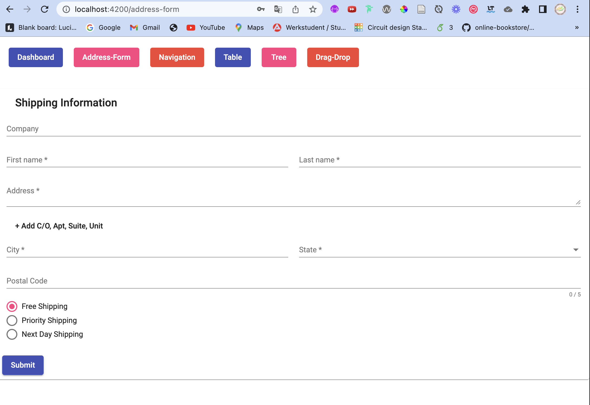
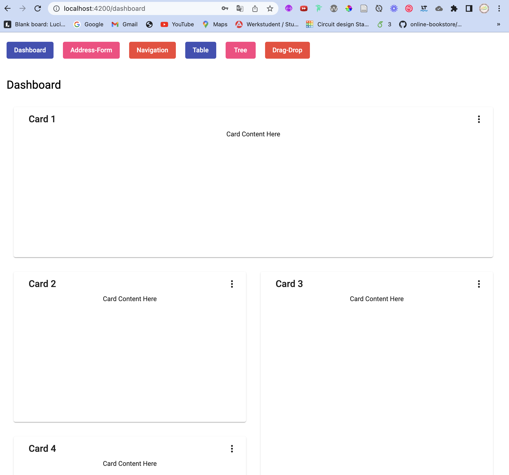
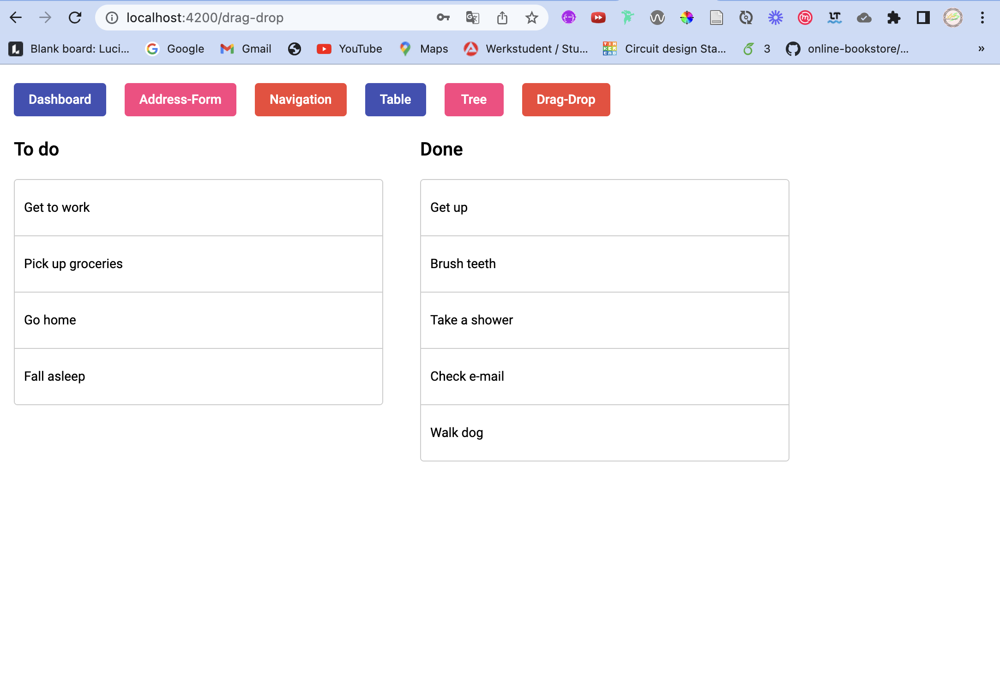
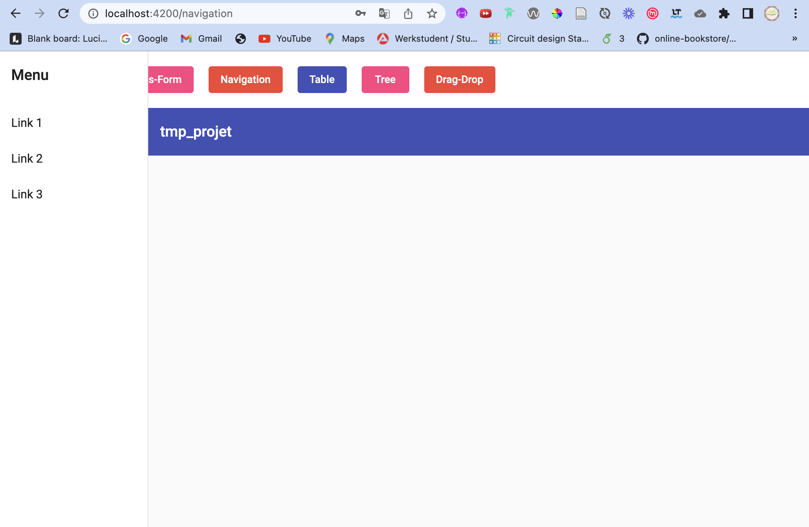
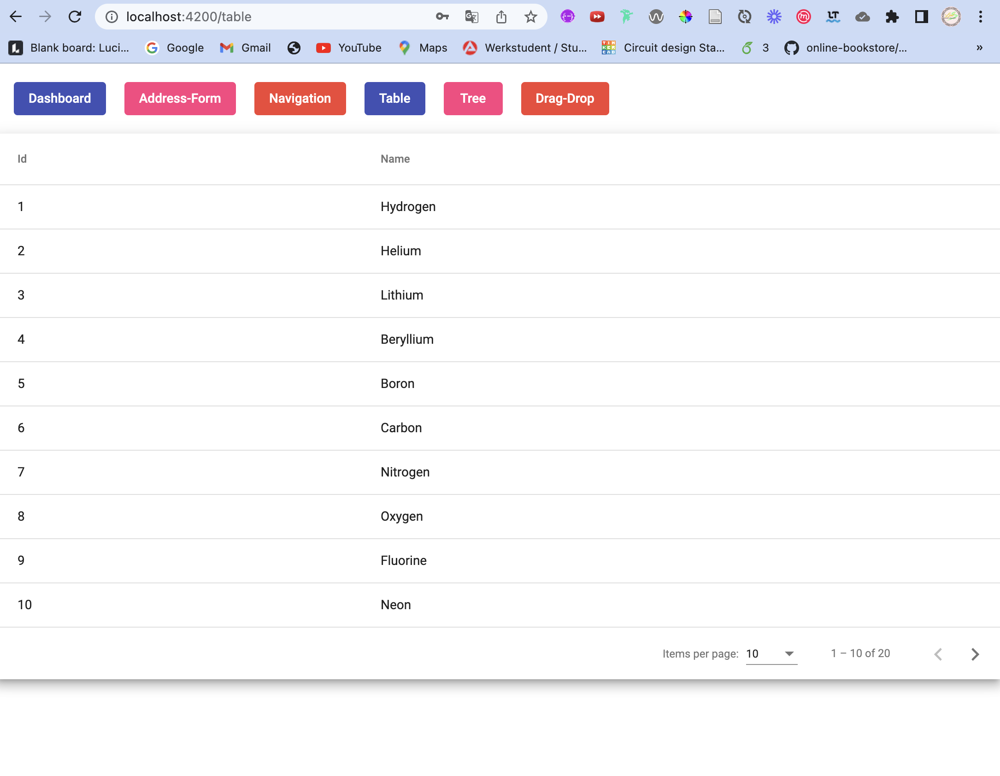
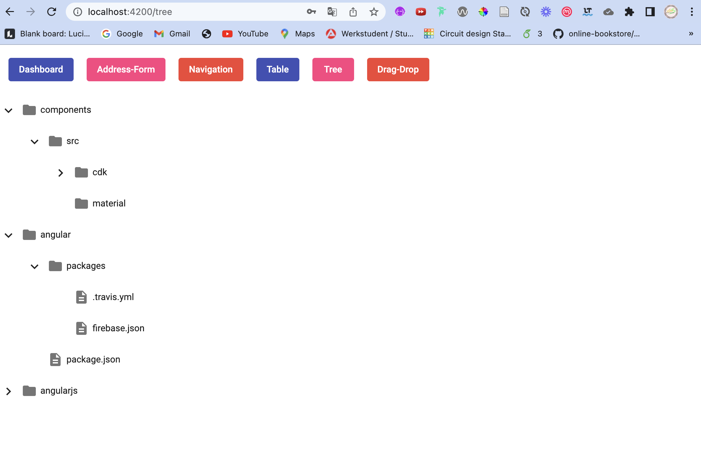

# Angular Material schematics

This project was generated with [Angular CLI](https://github.com/angular/angular-cli) version 14.2.7.
Here we use the angular material schematics for a address-form, dashbord, drag-drop, navigation, table and tree.

# To Start
```bash
git clone https://github.com/donchi-donald/angular_material_schematics
cd angular_material_schematics
ng serve
``` 
open your Browser and tipp: http://localhost:4200/ 
# Important command to start
important help command

## Install Schematics
 ```bash
 #schematic for angular material
 ng add @angular/material
 #schematic for Component Dev Kit
 ng add @angular/cdk
 ```

## Generate componente Schematics
```bash
#Creates a component with a responsive Material Design sidenav and a toolbar for showing the app name
ng generate @angular/material:navigation navigation

#Generates a component with a Material Design data table that supports sorting and pagination
ng generate @angular/material:table table   

#Component that interactively visualizes a nested folder structure by using the <mat-tree> component
ng generate @angular/material:tree tree   

#Component that uses the @angular/cdk/drag-drop directives for creating an interactive to-do list
ng generate @angular/cdk:drag-drop drag-drop

#Component with a form group that uses Material Design form controls to prompt for a shipping address  
ng generate @angular/material:address-form address-form

#Component with multiple Material Design cards and menus which are aligned in a grid layout
ng generate @angular/material:dashboard dashboard  
```

# screenshot





